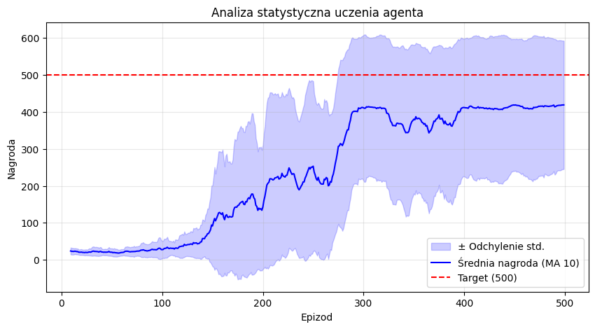
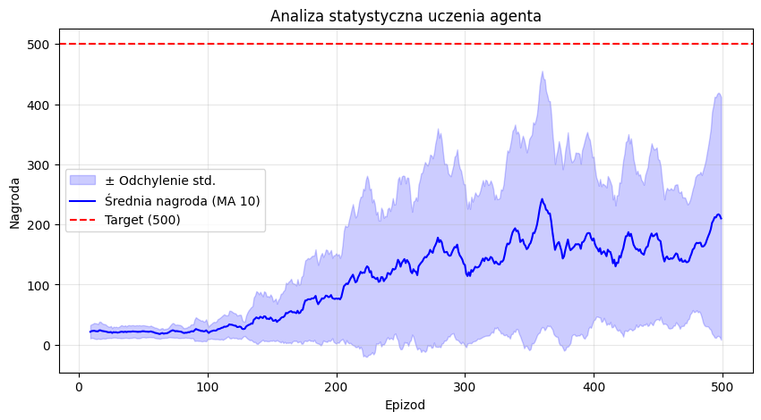
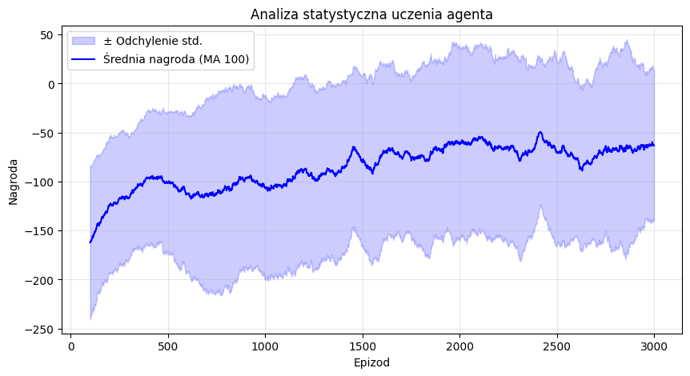

# Raport: Uczenie ze wzmocnieniem (QLearning i SARSA)

**Autor:** Robert Mesek  
**Data:** 26 kwietnia 2026

---

## Zadanie 1: Implementacja algorytmu Q-Learning

Zaimplementowano agenta Q-Learning rozwiązującego problem *CartPole-v1*. Kluczowym elementem była dyskretyzacja ciągłej przestrzeni stanów na kubełki (buckets) oraz implementacja równania aktualizacji wartości Q:

$$Q(s_t, a_t) \leftarrow (1-\alpha) Q(s_t, a_t) + \alpha \left( r_t + \gamma \max_{a} Q(s_{t+1}, a) \right)$$

### Wnioski
* Wyniki były trudne do interpretacji i poprawy początkowych parametrów ze względu na niestabilność uczenia. 

## Zadanie 2: Analiza statystyczna wyników

W celu oceny stabilności algorytmu przeprowadzono 5 niezależnych serii uczenia (po 500 epizodów każda). Wyniki poddano wygładzeniu średnią kroczącą z rozmiarem okna 10 oraz wyznaczono przedział ufności.

### Wnioski
* Średnia krocząca pozwala dostrzec trend wzrostowy ukryty pod oscylacjami wynikającymi z eksploracji.
* Odchylenie standardowe ukazuje dużą wariancję wyników gdy algorytm eksploruje nowe strategie.
* Algorytm jest bardzo wrażliwy na dobór parametrów, co bardzo widać pomiędzy kolejnymi uruchomieniami.

## Zadanie 3: Algorytm SARSA

Zaimplementowano algorytm SARSA, który w przeciwieństwie do Q-Learningu, aktualizuje wartość stanu na podstawie akcji faktycznie wybranej przez politykę:

$$Q(s_t, a_t) \leftarrow Q(s_t, a_t) + \alpha \left( r_t + \gamma Q(s_{t+1}, a_{t+1}) - Q(s_t, a_t) \right)$$

### Wnioski
* Wyniki dla algorytmu SARSA są zbliżone, jednak nieco gorsze niż dla Q-Learningu, jednak może to wynikać z wysokiej wariancji wyników i braku stabilności uczenia.
* Algorytm SARSA jest bardziej konserwatywny, co może prowadzić do wolniejszego uczenia, ale potencjalnie stabilniejszego zachowania w dłuższej perspektywie, jednak tego nie widać w naszych wynikach.

## Zadanie LunarLander

Zaimplementowano agenta Q-Learning dla środowiska *LunarLander-v3*.

### Wnioski
* Środowisko LunarLander jest znacznie bardziej złożone niż CartPole.
* Wymaga znacznie dłuższego czasu uczenia (3000 epizodów), ale obserwujemy rosnący trend nagród, co sugeruje, że agent uczy się skutecznie.